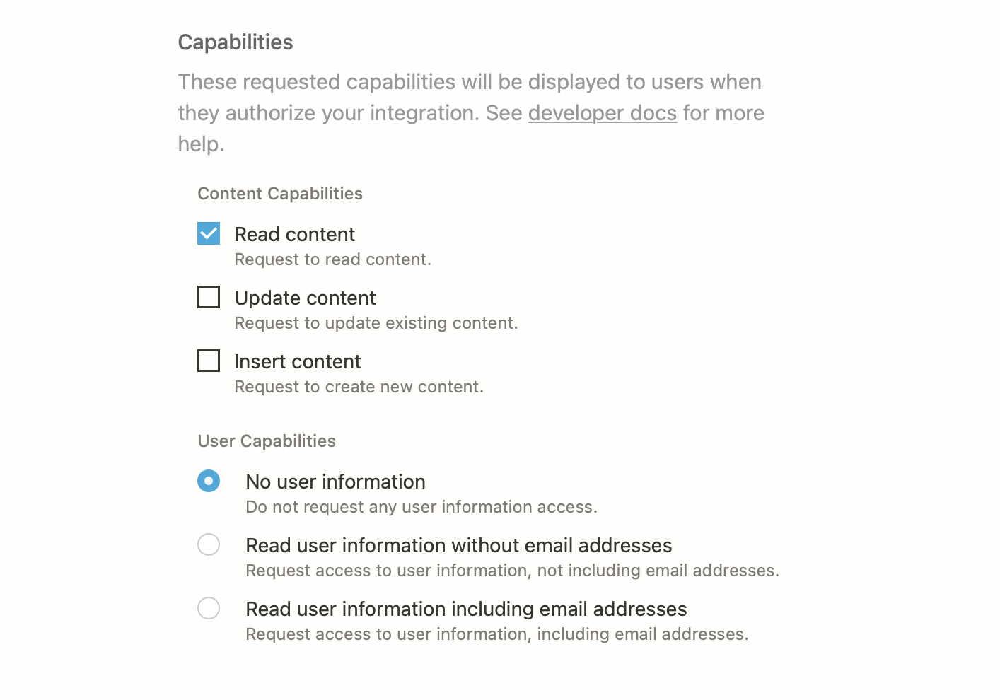
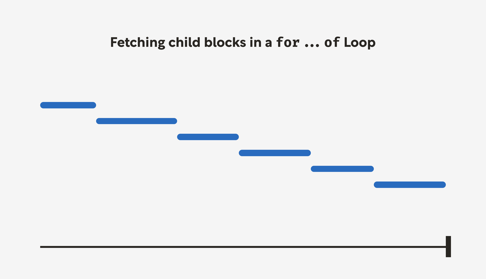
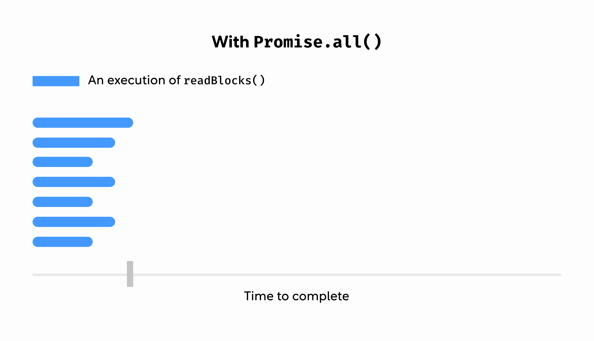

Notion allows me to collect, organize, and flesh out blog post ideas in a single place, but my painfully manual process of moving from Notion into Eleventy needs work. In this post, the first of a series, I’m going to crack open Notion’s API and see if there’s a way I can use it to streamline my blog workflow.

Since I’ve never used the Notion API before, I need to come up with a plan. After reading Notion’s excellent [API Getting Started guide](https://developers.notion.com/docs/getting-started), I have an initial strategy.

1. Create an integration.
2. Connect the integration with my Articles database.
3. Install the Notion JavaScript client in my Eleventy project.
4. Test the API.
5. Explore work flow ideas.

After I’ve established how to use the API, I’ll have a better idea how to build out a full publishing workflow, which I will implement in the next article. Let’s get started!


If you haven’t already, be sure to check it out my recent article on my current blogging process. I go into more depth about how I set up my blogging Notion.


## The set up

In order to use the Notion API, I need to first create an integration. Integrations are the way Notion authorizes API usage for a particular workspace. The instructions to [create an integration](https://developers.notion.com/docs/getting-started#step-1-create-an-integration) are fairly straightforward, but you will need to know the permissions you want your integration to have. 

Since my test only involves reading data, I’m only giving my integration the ability to read data. I’m also excluding user information since I’m the only user. In general, you only want to grant the bare minimum permissions (Notion calls them *capabilities*) you need to accomplish your goal.



After creating my integration, I’ll copy and paste the generated token to my local environment for later. If you’re following along, make sure you don’t paste that token into your codebase and commit it to git. Secrets should never be committed to your git history (I’ve learned this lesson the hard way).


If you should ever find yourself in a situation where you’ve committed a secret to your git history, fear not. **As long as you don’t push to a remote branch,** you can [rewrite your git history](https://git-scm.com/book/en/v2/Git-Tools-Rewriting-History) with either an amended commit or interactive rebase. Not that I’ve ever had to do that...😬


Now that I’ve created an integration, I still can’t use it because Notion will only allow access to pages and databases you have explicitly shared with the integration. You can share any page or database within the assigned workspace by navigating to the thing you want to share and clicking the *Share* button, then *Invite*. You should see your new integration in the resulting dialog.

I’ve invited my integration to a parent page of my Articles database. When you connect a page and/or database to an integration, all child entities come along for the ride. Now I have access to all of my articles. Very exciting!

## Testing the API locally

By now I have hopefully integrated Notion’s API with my Articles database. To test out the connection, I’ll first install the convenient [Notion JavaScript client](https://www.npmjs.com/package/@notionhq/client) in my blog’s codebase:

```bash
npm install @notionhq/client
```

I’ll also create a little sandbox script that will eventually become my publishing script.

```jsx
// notion.js

import { Client } from '@notionhq/client';

const NOTION_TOKEN = process.env.NOTION_TOKEN;

function doStuff() {
	console.log('Notion!');
}

doStuff();
```

Whenever I’m creating a script for automation or app integration, I like to start out with a simple script like this. I create a function, then I call that function. I also import whatever dependencies I *think* I’ll need and set up environment variables. I’ll then run this with `node`:

```bash
$ NOTION_TOKEN=you_super_secret_token node notion.js
Notion!
```

First I want to read my articles database, and for that, I’ll need a database ID. To get a database ID, navigate to the desired database in Notion (make sure to open it as a page if you haven’t already), open the kebab menu in the top righthand corner, and click *Copy link*. Paste that link somewhere. The portion between the last `/` and the `?` is the ID (if you’re looking at a page link, the ID is the bit after the slug).

```bash
# for databases
https://www.notion.so/<workspace>/<datbase_id>?v=...

# for pages
https://www.notion.so/<workspace>/<page_slug>-<page_id>
```

After I get the ID for my articles database, I can modify the dummy script to read the contents using the Notion API client:

```jsx
// notion.js

import { Client } from '@notionhq/client';

const NOTION_TOKEN = process.env.NOTION_TOKEN;

const notion = new Client({
  auth: NOTION_TOKEN,
});

async function readDatabase() {
  try {
    const response = await notion.databases.query({
      database_id: '6ae47178...', // Articles database ID
      filter: {
        and: [
          {
            property: 'Status',
            select: {
              equals: 'Published',
            },
          },
        ],
      },
    });
    console.log(JSON.stringify(response, null, 2));
  } catch (error) {
    console.log('error!');
    console.error(error.body);
  }
}

readDatabase();
```

Notice I’m only querying for articles with a *Status* of *Published*. You can [filter for a long list of properties](https://developers.notion.com/reference/post-database-query-filter). When I run that script, I can see a successful response (edited for brevity):

```json
{
	"object": "list",
	"results": [
		...
    {
      "object": "page",
      "id": "5b8889e9...",
      ...
    }
  ],
  "next_cursor": null,
  "has_more": false
}
```

Notion databases contain pages, and database queries return a response with a list of page objects. This is nice, but what I really want to do is read a page. After selecting a random page ID, I adjust my database script to read a page instead:

```jsx
// notion.js

import { Client } from '@notionhq/client';

const NOTION_TOKEN = process.env.NOTION_TOKEN;

const notion = new Client({
  auth: NOTION_TOKEN,
});

async function readPageInfo() {
  try {
    const page = await notion.pages.retrieve({
      page_id: '7b9c0c66ee...', // An random article
    });
    console.log(JSON.stringify(page, null, 2));
  } catch (error) {
    console.log('error!');
    console.error(error.body);
  }
}

readPageInfo();
```

Running this script returns a single [page object](https://developers.notion.com/reference/page). Looking at the page object, I can see that all my page properties are here:

```json
{
  "object": "page",
	...
  "properties": {
    "Publish Date": {
      "id": "%3BkvS",
      "type": "date",
      "date": {...}
    },
    "Tags": {
      "id": "%40GyO",
      "type": "multi_select",
      "multi_select": [...]
    },
    "Name": {
      "id": "title",
      "type": "title",
      "title": [...]
    },
    "Status": {
      "id": "prop_2",
      "type": "select",
      "select": {...}
    }
  },
	...
}
```

This is probably what I’ll need to build my post [front matter](https://www.11ty.dev/docs/data-frontmatter/). The page content, however, isn’t included in this response. 

When I first saw this, I was a bit confused (mostly because I wasn’t reading the reference docs), but this makes sense. Page content is relatively unbounded, so you could have thousands upon thousands of pieces of data objects associated with a page object. Returning all of that data in a single response would be disastrous for the API’s network.

So how do I get to a page’s content? For that, I’ll need to read the page’s child blocks.


If you’re interested in learning more about the design of Notion’s API, checkout their [breakdown of the API creation process](https://www.notion.so/blog/creating-the-notion-api).


## Reading page content

In Notion, all content, including pages, are modeled as [blocks](https://developers.notion.com/reference/block). Blocks can contain child blocks, which is the case with pages. We can use the Notion API to query a block’s children like this:

```jsx
// notion.js

import { Client } from '@notionhq/client';

const NOTION_TOKEN = process.env.NOTION_TOKEN;

const notion = new Client({
  auth: NOTION_TOKEN,
});

async function readBlocks() {
  try {
    const blocks = await notion.blocks.children.list({
      block_id: '7b9c0c66ee...',
    });

    console.log(JSON.stringify(blocks, null, 2));
  } catch (error) {
    console.log('error!');
    console.error(error.body);
  }
}

readBlocks();
```

The response includes *some* of the page’s blocks, but not all of them. By design, blocks with children don’t return with their child blocks resolved (again, for data size concerns). They do, however, include a `has_children` property of `true`. We can use that property, as well as the block’s `block_id`, to recursively fetch child blocks.

```jsx
// notion.js

import { Client } from '@notionhq/client';

const NOTION_TOKEN = process.env.NOTION_TOKEN;

const notion = new Client({
  auth: NOTION_TOKEN,
});

// block ID is now a param
async function readBlocks(blockId) {
	blockId = blockId.replaceAll('-', '') // strip all dashes

  try {
    const { results, ...blocks } = await notion.blocks.children.list({
      block_id: blockId,
    });
    const expandedResults = [];

    for (let block of results) {
      if (block.has_children) {
        block.children = await readBlocks(block.id); // recursion FTW!
      }

      expandedResults.push(block);
    }

    return { ...blocks, results: expandedResults }; // we need to return something
  } catch (error) {
    console.log('error!');
    console.error(error.body);
  }
}

readBlocks('7b9c0c66ee...')
	.then((data) => JSON.stringify(data, null, 2))
  .then(console.log);
```

This successfully returns a block’s children and assigns them to a `children` property (hooray!). There is a slight problem with this script, however. In the `for...of` loop, we `await` the results of the child `readBlocks` call. The current script execution pauses until the awaited Promise settles, which slows the script down considerably when dealing with a large number of nested blocks.



We can improve this with `Promise.all`.

```jsx
// notion.js

import { Client } from '@notionhq/client';

const NOTION_TOKEN = process.env.NOTION_TOKEN;

const notion = new Client({
  auth: NOTION_TOKEN,
});

async function readBlocks(blockId) {
  blockId = blockId.replaceAll('-', '');

  try {
    const { results, ...blockResponse } = await notion.blocks.children.list({
      block_id: blockId,
    });

    const childRequests = results.map(async (block) => {
      if (block.has_children) {
        const children = await readBlocks(block.id);
        return { ...block, children };
      }
      return block;
    });

    const expandedResults = await Promise.all(childRequests);

    return { ...blockResponse, results: expandedResults };
  } catch (error) {
    console.log('error!');
    console.error(error.body);
  }
}

readBlocks('7b9c0c66ee...')
	.then((data) => JSON.stringify(data, null, 2))
  .then(console.log);
```

Notice the results are now mapped to promises (`async` functions automatically wrap their return values in a promise even if they’re a synchronous value). Each read process is immediately kicked off, and we simply wait for all of them to be resolved before moving on. This is much faster than reading child blocks one request at a time.



Now that we have a way to read page properties and page content, we’ll finish up this exercise by writing this information to a local file. For that, we can use node’s `fs` module:

```jsx
import { Client } from '@notionhq/client';
import { writeFile } from 'fs/promises';

const NOTION_TOKEN = process.env.NOTION_TOKEN;

const notion = new Client({
  auth: NOTION_TOKEN,
});

async function readBlocks(blockId) {
  blockId = blockId.replaceAll('-', '');

  try {
    const { results, ...blockResponse } = await notion.blocks.children.list({
      block_id: blockId,
    });

    const childRequests = results.map(async (block) => {
      if (block.has_children) {
        const children = await readBlocks(block.id);
        return { ...block, children };
      }
      return block;
    });

    const expandedResults = await Promise.all(childRequests);

    return { ...blockResponse, results: expandedResults };
  } catch (error) {
    console.log('error!');
    console.error(error.body);
  }
}

async function readPage(pageId) {
  const pageInfo = notion.pages.retrieve({
    page_id: pageId,
  });
  const pageContents = readBlocks(pageId);

  try {
    const [info, contents] = await Promise.all([pageInfo, pageContents]);

    return { ...info, contents };
  } catch (error) {
    console.log('error!');
    console.error(error.body);
  }
}

readPage('7b9c0c66ee...')
  .then((data) => JSON.stringify(data, null, 2))
  .then((data) => writeFile('test.json', data));
```

## Wrapping up

This is a great place to stop for now. To review, I started out by creating an initial plan, then I tackled the plan step-by-step. When I ran into issues (e.g. discovering page objects don’t include content), I amended the plan.

Now I have a data structure written to a local file that includes everything I need to write a post. The main challenge left, then, is transforming that data into something I can consume in Eleventy. I’ll cover that in my next article.

I should note I purposely chose a page that was very small and contained simple content. I didn’t want to get bogged down troubleshooting edge cases when all I wanted to do was explore the API. Keep in mind there are [API limits](https://developers.notion.com/reference/request-limits), and if your content is relatively large and complex, you will encounter them at some point.

Dealing with these limits is outside the scope of this post, but I may in the future write a dedicated post on how to work with API limits (e.g. rate limits, pagination, etc.). If that’s something you’d like to read, let me know!

If you’ve enjoyed this post, please consider sharing it with others that might like it. And if you have any comments, please reach out to me on Twitter. I love to discuss all things front end, and it quite frankly gives me the warm fuzzies to know other people are reading these posts.

Until next time!