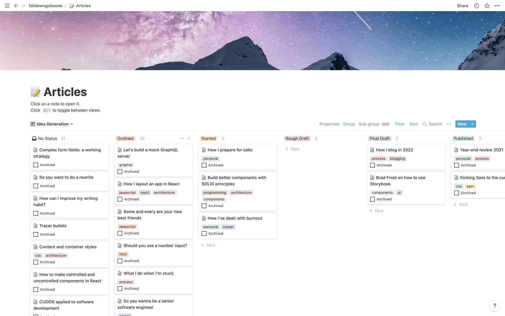

It’s a new year, and I’m eager to get back into the habit of blogging on my site. To start, I'm taking another look at my blogging process and what has changed since the last time I wrote about it.

## Idea generation

I’ve maintained a blogging Notion for a couple of years now, but I recently adopted [Dave Rupert’s Notion blogging kanban](https://daverupert.com/2021/09/my-notion-blogging-kanban/).

<figure>
  
  <figcaption>My blogging kanban, which is completely aped from Dave Rupert. Thanks, Dave!</figcaption>
</figure>

The kanban has six lanes: *No Status*, *Outlined*, *Started*, *Rough Draft*, *Final Draft*, and *Published*. Ideas get chucked into the *No Status* lane and slowly make their way from left to right on the board as the post develops.

Each lane is sorted by *Last Updated,* which I love. As Dave explains:

> This gives me a “What’s hot” vibe for each column. It helps me keep momentum on my latest ideas —a freshness seal— to keep them from falling out of view.

If a story gets too stale or I notice it hasn’t progressed in a while, I archive it, which removes it from the kanban view. I have a separate view for these archived, unpublished ideas, which Dave calls the *Deadpool*. I’ve added a dedicated view for these in case I need to search through them.

Like Dave, I’ve also added a view that organizes all my posts by tag. I haven’t used this view much, but it’s nice to see at a glance what topics I tend to favor.

## Publishing

Publishing is still as manual as ever. I export the post out of Notion as Markdown and add it to my local website instance. I adjust the front matter, then send it through Grammarly for final corrections.

After finalizing the article, I commit and open a pull request on GitHub. Pull requests automatically start project tests and spin up a staging site, thanks to Netlify and GitHub actions. After verifying that all is well, I merge into the main branch, and Netlify does the deployment.

Keeping everything in Notion is great because everything is in the same place. The downside is publishing is still a ridiculously manual process. I plan to address this later this month by checking out [Notion’s API](https://developers.notion.com).

## Blogging frequency

After completing a [daily blogging challenge last year](https://www.falldowngoboone.com/blog/blogruary-28-days-of-posting/), I thought seriously about setting a weekly blogging goal. I had written a new piece every day; how hard could it be to move to a weekly schedule? As it turns out, quite hard.

Life happens, and in 2021 it *really* happened. I talk more about it in my [2021 year-end review](https://www.falldowngoboone.com/blog/year-end-review-2021/), but I got burned out, lost family members, and started a new job. To say my life was chaotic is a bit of an understatement.

That’s not to say that I shouldn’t expect to produce content regularly. I stopped writing because I didn’t have a consistent habit. That’s why I like setting blogging challenges. They give me something to aim for, which keeps me focused on the process itself.

## Other changes

When I first launched [my latest blog design](https://www.falldowngoboone.com/blog/how-im-redesigning-my-blog/) in 2020, there were more than a few rough edges (by design). I also didn’t know what I wanted because I had never consistently published content. 

After upping my content production, I was able to see [glaring holes in my simple design](https://www.falldowngoboone.com/blog/what-i-learned-blogging-daily-for-a-month/#did-not-work%3A-my-website-styling-is-lacking) that needed plugging. 

I made much progress toward plugging those holes in 2021. I shipped several new features, my favorite of which is [my new home page](https://www.falldowngoboone.com). Other shipped features include styling for blockquotes, footnotes, asides, etc. 

I’m looking forward to adding some form content later this year when I add a contact section. I have plans to make it especially fun and (hopefully) educational. I also plan on shipping a dark theme in the next couple of months.

## Conclusion

So that’s a quick look at my blogging process for early 2022. I like doing these because it helps me understand what’s working and what isn’t. I hope you enjoy them too.

This year should prove interesting. I’ve got some GraphQL and TypeScript content planned, in addition to some of my UI component philosophy. If that sounds like something you’d like to read more about, give me a follow on [Twitter](https://twitter.com/therealboone) or [DEV Community](https://dev.to/falldowngoboone) to be notified when these posts are published.

Until next time!