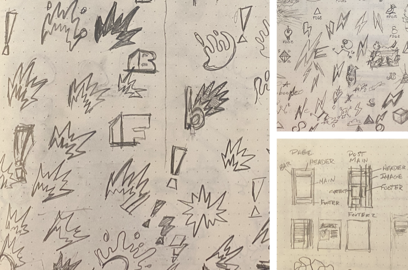
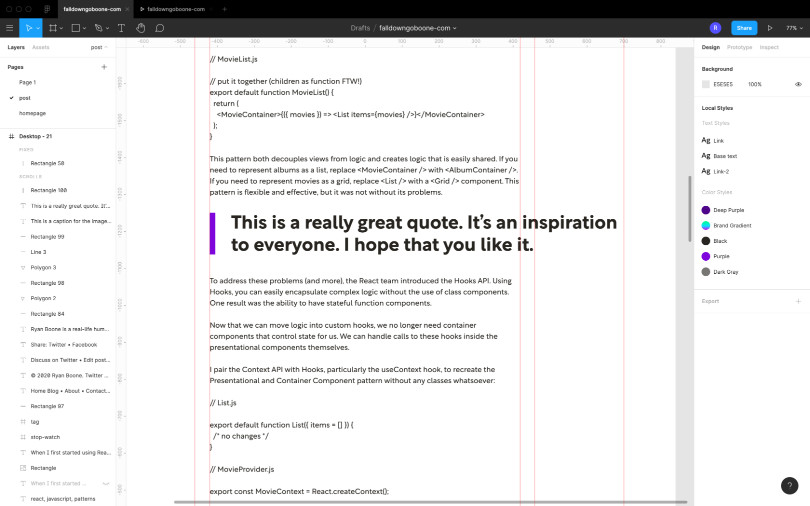
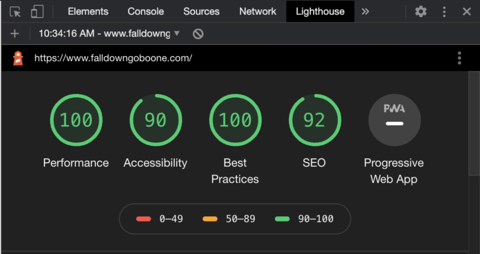
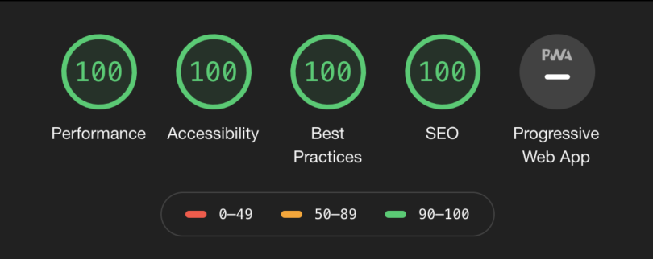

Personal projects are a great way to grow your skillset, learn new technologies and explore new ideas. I began my personal blog with that in mind, but also wanted to share what I learn. With that in mind, I wanted to try and document the process behind this new redesign.

---

I began this current redesign almost immediately after finishing my last redesign. My original plan was to launch a default Gatsby starter blog and then incrementally redesign it. That did not go as planned.

Difficulties with Gatsby conventions (like using the GraphQL data mesh layer and MDX weirdness) and a growing concern over build performance led me to eventually abandon the framework. I spent the next year or so trying out different tools and tweaking design decisions, until I landed on what you see here.

## The Design

As I write this, the design and build out are not complete, but I've decided to launch what I have so far. Why? I have confidence that getting the design out into the real world will help me iterate on it quicker, and I can easily see which ideas have value and which do not. With that said, here are some highlights of the design.

### Inspiration

I have always been a fan of the [Swiss Style](https://en.wikipedia.org/wiki/International_Typographic_Style), so I knew I wanted to incorporate a strong grid with a grotesque typeface. The grid on the blog pages is based on the Golden Ratio, with the main block on wide displays being roughly 0.618 times the width of the full grid. The text blocks are limited in line length using `ch` units, which equal the width of a font's `0` character.

Breaking with the Swiss Style, and as an homage to the [cartoons that inspired this blog's name](https://en.wikipedia.org/wiki/A_Gruesome_Twosome), I wanted to include hand-drawn illustrations and decoration, just so the site itself didn't end up feeling too cold or rigid.

<figure>
  
  <figcaption>Initial sketches of hand-drawn element ideas</figcaption>
</figure>

My process has been sketching out ideas on paper first, then moving into Figma or Affinity Designer for high fidelity exploration. I've tried to move to designing in the browser as quickly as possible because that's the medium the design will ultimately end up in. If I run into a design roadblock in the browser, I return to Figma or Affinity Designer and explore some more.

<figure>
  
  <figcaption>Design exploration in Figma</figcaption>
</figure>

### Fonts

I love geometric typefaces, but they tend to be cold. Since I have hand-drawn elements, I wanted something with a bit more warmth. [Rotunda](https://www.myfonts.com/fonts/tipotype/rotunda/) filled the role perfectly, with a mix of geometric and humanistic forms. Oh, and I'm a sucker for double-story 'g's and 'a's.

<figure>
  
  <figcaption>Rotunda has humanistic forms as well as geometric alternates</figcaption>
</figure>

I'm using Rotunda almost exclusively for headings, and for the body copy I'm opting for a simple [system font stack](https://css-tricks.com/snippets/css/system-font-stack/). I'm still weighing the cost/benefit of using Rotunda for body copy as well. I'm trying to be somewhat conservative with the page weight.

### Animated gradient links

One element of this design I really like, heavily inspired by CSS-Tricks, is the animated gradient link hover style. The effect is achieved using an oversized background gradient clipped to the text with `background-clip: text`. The only thing that's animated is the `background-position`.

There's some `box-decoration-break` magic that makes sure the background style translates properly across line breaks, and `-webkit-text-fill-color: transparent` is needed to hide the text color.

<p class="codepen" data-height="500" data-theme-id="dark" data-default-tab="css,result" data-user="falldowngoboone" data-slug-hash="MWeXqoy" style="height: 265px; box-sizing: border-box; display: flex; align-items: center; justify-content: center; border: 2px solid; margin: 1em 0; padding: 1em;" data-pen-title="Gradient animation on hover">
  <span>See the Pen <a href="https://codepen.io/falldowngoboone/pen/MWeXqoy">
  Gradient animation on hover</a> by Ryan Boone (<a href="https://codepen.io/falldowngoboone">@falldowngoboone</a>)
  on <a href="https://codepen.io">CodePen</a>.</span>
</p>
<script async src="https://static.codepen.io/assets/embed/ei.js"></script>

## The Stack

### Eleventy and ~~Liquid~~ Nunjucks

The new design is completely static and built with [Eleventy](https://www.11ty.dev). I've chosen Eleventy to replace my previous framework of Gatsby mainly because of Eleventy's flexibility and ease of use. Eleventy is also a great deal faster than Gatsby, though my site is so small that I've barely noticed a difference when building.

~~My template language of choice is Liquid, which, to be honest, I'm rethinking. The syntax can be quite awkward at times (possibly because of its Ruby origins). For example, empty strings in Liquid are truthy values, as opposed to JavaScript, where they are falsy, so in cases where you can either have a falsy value or an empty string, you must check for both. This is something that could be solved with something like a custom filter, but it's quite annoying, and certainly not the only quirk this template language has.~~

**Update:** Yeah, so, I'm not using Liquid anymore. The biggest reason is a practical one: the syntax highlighting and language support has been a constant pain to manage in VS Code. I've been using the [Liquid VS Code extension](https://marketplace.visualstudio.com/items?itemName=sissel.shopify-liquid), which I've had to completely disable due to an incident where it fried some source code at work (long story short, there's a bug that causes it to encode certain tokens that unknowingly rewrote a large portion of some JSP templates). Even before that, it wasn't that great of an extension. The author is supposedly rewriting it into a freemium extension called [Liquify](https://github.com/panoply/vscode-liquid/issues/56), but I'm not terribly interested.

To be honest, using Liquid at this point feels like swimming upstream. I've switched to Nunjucks, and already I feel less tension with my editor. I was able to convert everything over in an hour or so. I won't tell you how long it took me to convert over to Liquid.

### Modern CSS

CSS has been going through a layout renaissance over the past few years, and I have been keen to explore some [Intrinsic Web Design](https://aneventapart.com/news/post/designing-intrinsic-layouts-aea-video) techniques. In particular, I wanted to avoid screen width media queries as much as possible. And as I'm working toward that goal, I've been using this site to get better acquainted with [CSS Grid](https://developer.mozilla.org/en-US/docs/Web/CSS/CSS_Grid_Layout).

I'm also using some [fluid typography](https://css-tricks.com/snippets/css/fluid-typography/), as well as the shiny new [`clamp`](https://developer.mozilla.org/en-US/docs/Web/CSS/clamp) function. I should note that fluid typography utilizes viewport units, which breaks custom default values for users. For that reason, I've limited the fluid typography to the page title and site spacing.

Of course, this wouldn't be modern CSS without a good dose of custom properties. I'm trying to use property names that are more representational of their use and not their description (e.g. `--color-main` instead of `--color-black`). This should make it easier for theming in the future for things like a "dark mode."

```scss
:root {
  --color-main: #{$color-black};
  --color-secondary: #{$color-gray-700};
  --color-bg: white;
  --color-bg-secondary: #{$color-gray-200};
  --color-border: #{$color-gray-500};

  --link-color: #{$color-purple};
  --title-color: #{$color-purple};

  --code-bg: #fffafb;
  --code-color: #e2003a;
  --code-border: #ffe7ed;
}
```

Finally, I'm following the [ITCSS](https://www.xfive.co/blog/itcss-scalable-maintainable-css-architecture/) way of organization for all of my styles. If given the choice, it's my preferred methodology. I think the concept of going from wide usage and weak specificity toward very specific, focused styles best represents my mental model of CSS.

### Dart Sass

This is the first project where I have fully embraced [Dart Sass](https://sass-lang.com/dart-sass) over [`node-sass`](https://www.npmjs.com/package/node-sass). There are a few reasons for this.

First of all, Dart Sass has the latest and greatest Sass goodies, like [Sass modules](https://sass-lang.com/blog/the-module-system-is-launched), which offer a superior experience for limiting the scope of modules and optimizing imports. I personally like the explicitness of creating namespaces so you know what file that magical mixin came from.

Second, in case you haven't heard, [LibSass is being deprecated](https://github.com/sass/libsass/issues/3123). It seems Dart Sass will soon be the only supported implementation of Sass. LibSass has been known for its superior speed (an advantage it still has over the JavaScript bindings for Dart Sass), but it has also been plagued with a slow development cycle.

This slow development cycle means LibSass can't even keep up with the CSS spec. If you attempt to use the `max` or `min` functions as they are supported in CSS, you will receive an error due to Sass's history with these functions. [There are workarounds for this and other issues](https://css-tricks.com/when-sass-and-new-css-features-collide/), but I prefer not to bother with them.

### Netlify

Finally, in order to get my site to you, I'm using [Netlify](https://www.netlify.com). There's nothing really special about my deployment configuration; it's basically the configuration file that Eleventy generates. The only difference is I'm generating the Sass at build time as well.

Something to note: when I first deployed the new site, I kept getting a build error. It looked like there was a process that wasn't ending properly. Turns out my the `clean` script I had added to the `build` was the culprit. I've patched up the issue by creating a separate build step for production only.

I think eventually I would like to write a custom build script, one that relies on environment variables to do things like watch for changes or clean build files. This is something I've been trying to work towards in my work on The Container Store website's front end tooling, and this would be a great place to try some different ideas out.

### Metrics

One reason people tend to pick static site generators is performance, so how does my site perform? It depends on what day you're auditing the site. I'm still tweaking some of my Lighthouse scores, but performance is coming out to a score of 100. Honestly, my Gatsby site had the same score (again, this is not a big site at the moment, and it's mostly text).

<figure>
  
  <figcaption>Site metrics in Lighthouse at original publish date (November 15, 2020)</figcaption>
</figure>

Some things I need to work on are SEO and some annoying duplicate ID issues that are dinging me on my Accessibility score. Ultimately, the goal is to get to 100 in all categories, and hopefully I'll get there by the time people are reading this post.

**Update:** The last few issues have been corrected and now I'm getting all 100s!

<figure>
  
  <figcaption>Updated site metrics in Lighthouse on November 16, 2020</figcaption>
</figure>

## The Future

So, I am by no means done with the site. My future plans are to add a contact form that utilizes Netlify forms, add an About page with some more detail about me, and add a bookshelf section that shows what I've been reading. In terms of features, I'd like to integrate my Twitter feed into the home page to show my latest TIL (today I learned) tweet, add site-wide messaging, finish the home page layout, and possibly switch from Liquid templates to Vue via [Eleventy's experimental Vue support](https://www.netlify.com/blog/2020/09/18/eleventy-and-vue-a-match-made-to-power-netlify.com/).

I also want to incorporate more design elements I just haven't been able to get to, like adding animations and more hand-drawn visuals. I want to be considerate of site performance as well, so I'm cautiously experimenting with different approaches.

## Conclusion

So that's a short overview of my blog's redesign. I promise there's more to come, but my ultimate goal is to push past my tendency for perfectionism. You can't share what you're doing if you wait for perfection. I hope this has been helpful in some way to you.

Are you in the middle of designing and/or building your own personal project? I want to hear from you. Do you have any questions about my process or the stack I'm using? I want to hear from you, too.

Until next time!