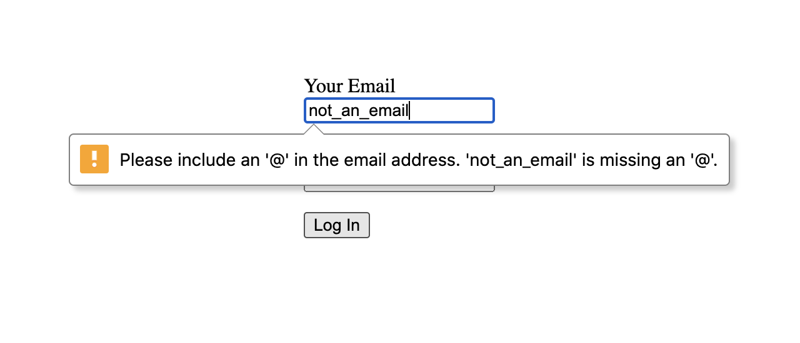

You don't need to install a validation library to create rich client-side form validation experiences. HTML5's native client-side form validation is widely-supported and easy to implement, and while its default functionality is limited, the native [Constraint Validation API](https://developer.mozilla.org/en-US/docs/Web/API/Constraint_validation) allows for custom behavior with JavaScript.

## Enter the humble login form

Let's build a login form. We'll use an input for email, password, and a submit button:

```html
<!-- login.html -->

<form id="login-form" action="/api/auth" method="post" >
  <div>
    <label for="email">Your Email</label>
    <input id="email" type="email" name="email" />
  </div>
  <div>
    <label for="password">Your Password</label>
    <input id="password" type="password" name="password" />
  </div>
  <div>
    <button>Log In</button>
  </div>
</form>
```

That's a pretty bare-bones login form. There are two inputs, one with a type of `email`, the other with a type of `password`, and a submit button. The form posts to an endpoint that handles the login process on the server[^server].

[^server]: Our imaginary backend script also validates and sanitizes the data posted from the form. Client-side validation is a user experience enhancement. Never trust user-generated data and always validate on the server.

Even though we haven't yet done anything to the form, it already has some client-side validation built in, thanks to the `email` input. If you were to enter an invalid value into the email field and submit, you would see something like this (screenshot from Chrome):



The browser has blocked the submission of data, focused the first invalid field, and now we see an error message describing the issue. We have email validation, and at no point did we type `npm install` and download half of all known JavaScript dependencies.

There is a problem, though. If you submit with both fields left blank, the form submits as valid, but our backend script requires both fields.

## Requiring fields

There's an easy fix for the valid blank fields. Let's add the `required` attribute to both the email and password inputs.

```html
<!-- login.html -->

<form id="login-form" action="/api/auth" method="post" >
  <p>
    <label for="email">Your Email</label><br/>
    <input id="email" type="email" name="email" required />
  </p>
  <p>
    <label for="password">Your Password</label><br/>
    <input id="password" type="password" name="password" required />
  </p>
  <p>
    <button>Log In</button>
  </p>
</form>
```

Now submitting without an email or password will look something like this (again, screenshot from Chrome):


So far, so good. Who needs JavaScript?

## Styling error state

You might want to style your error state to draw more attention to fields with issues. We can do that by using the `:invalid` CSS pseudo-class.

```css
/* login.css */

input:invalid {
  border-color: hsl(351, 100%, 27%);
}
```

Now we see the first issue: HTML forms run validation immediately. By default, both the email and password fields are blank, and since they are required, they immediately render invalid. Boo!

Ideally, we would want the fields to appear valid until a user attempts to enter a value. We could choose either to validate on blur or wait until the user tries to submit the form. Either way, we want to validate invalidated fields as their values update to ensure the quickest feedback possible.

Sadly, we have reached the limits of default HTML client-side form validation. But fear not! We have access in JavaScript to all that validation goodness in the form of the aforementioned Constraint Validation API.

## Validation, final form

The Constraint Validation API gives you complete access to the built-in validation we've been using up to this point but with more control. The first rule of Constraint Validation, much like Fight Club, is to not talk about validation:

```jsx
// login-validate.js

const form = document.getElementById("login-form");

form.noValidate = true;
```

Setting `noValidate` turns off the native client-side validation, freeing us up to do whatever we want. Turning off validation with JavaScript ensures the default validation still runs if JavaScript never executes for whatever reason. It also prevents showing our invalid style preemptively.

The first thing we should do is run validation when the form is submitted. To validate the entire form, use the form method `reportValidity`:

```jsx
// login-validate.js

const form = document.getElementById("login-form");

form.noValidate = true;

form.addEventListener('submit', function handleFormSubmit(event) {
  const isValid = form.reportValidity();

  if (isValid) {
    // POST form data to backend with fetch
  }

  event.preventDefault();
});
```

`reportValidity` runs the form validation, returns `true` or `false` based on whether or not the form is valid, and reports any validation errors to the user. We can use the return value to determine whether or not to post to the backend.

## Marking invalid inputs

Before taking the validation reins we could tie into the convenient `:invalid` pseudo-class to style invalid fields, but now that's no longer an option. Let's fix that next.

When `reportValidity` runs, it will dispatch an [`invalid`](https://developer.mozilla.org/en-US/docs/Web/API/HTMLInputElement/invalid_event) event for each invalid field. This event is cancellable, but it doesn't bubble, which means we'll have to register an event handler on each element in the form:

```jsx
// login-validate.js

// ...

for (const field of form.elements) {
  field.addEventListener("invalid", function handleInvalidField(event) {
    field.setAttribute("aria-invalid", "true");
  });
}
```

This will add the `aria-invalid` attribute to invalid elements, which not only communicates validity state to accessible technology, it gives us a new hook for our invalid styles[^aria].

[^aria]: To learn more about ARIA attributes, roles, and relationships, check out the [WAI-ARIA specification](https://www.w3.org/TR/2021/CR-wai-aria-1.2-20210302/).

```css
/* login.css */

input:invalid,
[aria-invalid=true] {
  border-color: hsl(351, 100%, 27%);
}
```

Whenever I can, I try to tie style to semantics. This helps communicate the importance of the selector's existence and avoids unnecessary styles that may not be that reusable outside of the current context.

The styles work now, but they remain even after the input becomes valid. Before we can correct that, there's another problem we need to solve.

## Our new validation pattern

We need to talk briefly about how we want this custom validation to work. Luckily for us, form error UX is well-researched. For this example, I'm referring to [guidelines published by the Nielsen Norman Group](https://www.nngroup.com/articles/errors-forms-design-guidelines/). 

Here's a quick summary of the plan:

- Each field will first validate on the `blur` event. This will avoid displaying warnings too early.
- Once a field has been visited initially, it will validate on user input. Immediate feedback helps users verify the information they've entered is correct. This also addresses the invalid style issue we currently have.
- Errors will be displayed alongside the field. We'll replace the default error tooltips with inline messages that remain on screen as long as the field is invalid.

First I'll add the validation on field blur. We'll add that to our previous field level JavaScript:

```jsx
// login-validate.js

// ...

for (const field of form.elements) {
  // previous code
  field.addEventListener("invalid", function handleInvalidField(event) {
    field.setAttribute("aria-invalid", "true");
  });

  // new
  field.addEventListener("blur", function handleFieldBlur() {
    field.removeAttribute("aria-invalid");
    field.checkValidity();
  });
}
```

When a field element dispatches a `blur` event, we optimistically remove the `aria-invalid` attribute and then run `checkValidity`, which does everything `reportValidity` does except report validation errors to the user. We'll handle error reporting ourselves later.

Next, we need to run validation on user input, but only after a field has been previously visited. For that, we'll need some local state.

## Validating on user input

For tracking fields that have been visited, we'll use a simple JavaScript array. Once a field has been visited, we'll push it into the array. To check for visited status, we query the array to see if the field is included.

```jsx
// login-validate.js

// ...

// new
const visited = [];

// ...

for (const field of form.elements) {
  // ...

  field.addEventListener("blur", function handleFieldBlur() {
    // new
    if (!visited.includes(field)) {
      visited.push(field);
    }

    // REMOVED field.removeAttribute("aria-invalid");
    field.checkValidity();
  });

  // new
  field.addEventListener("input", function handleFieldInput(event) {
    if (!visited.includes(field)) return;
  
    if (!field.validity.valid) {
      field.setAttribute("aria-invalid", "true");
    } else {
      field.removeAttribute("aria-invalid");
    }
  });
}
```

Here we have added a `visited` array and are adding fields to it inside `handleFieldBlur`. We're also removing the `aria-invalid` attribute code since it's now handled in the new input handler.

Inside the input handler, we prevent validation from running before the field has been visited with a short circuit. We check the field's validity using its [`ValidityState`](https://developer.mozilla.org/en-US/docs/Web/API/ValidityState), which is a handy object that contains everything related to field validation. More on that in a bit.

At this point, the desired validation behavior is done. The final thing we need to do is add custom error styling.

## Custom inline errors

The current error messages only show up on a submission attempt and have the default tooltip styling. We want to show the errors directly underneath the invalid fields and update them on blur and user input. We need to first create containers for the error messages.

```html
<!-- login.html -->

<form id="login-form" action="/api/auth" method="post" >
  <div>
    <label for="email">Your Email</label>
    <input id="email" type="email" name="email" 
          aria-describedby="email-error" /> <!-- new -->
    <span id="email-error"></span> <!-- new -->
  </div>
  <div>
    <label for="password">Your Password</label>
    <input id="password" type="password" name="password" 
          aria-describedby="password-error" /> <!-- new -->
    <span id="password-error"></span> <!-- new -->
  </div>
  <div>
    <button>Log In</button>
  </div>
</form>
```

The important thing to notice in the above markup is we've added an `aria-describedby` attribute to both inputs. This attribute ensures that screen readers associate each error message with its respective input. When an invalid input is focused, the screen reader will announce the input's label and type, pause briefly, then announce the error[^described].

[^described]: `aria-describedby` can take multiple IDs separated by spaces (`aria-described="first-id second-id third-id"`). This is helpful if you have instructions associated with an input, like password constraints.

We now need to populate the error containers with the appropriate error messages. Luckily the input fields have access to their validation messages:

```jsx
// login-validate.js

// ...

for (const field of form.elements) {
  field.addEventListener("invalid", function handleInvalidField(event) {
    errorContainer(field).textContent = field.validationMessage; // new
    field.setAttribute("aria-invalid", "true");
    event.preventDefault(); // new, prevents default validation errors
  });

  // ...

  field.addEventListener("input", function handleFieldInput(event) {
    if (!visited.includes(field)) return;
  
    if (!field.validity.valid) {
      errorContainer(field).textContent = field.validationMessage; // new
      field.setAttribute("aria-invalid", "true");
    } else {
      errorContainer(field).textContent = ""; // new
      field.removeAttribute("aria-invalid");
    }
  });
}

// new
function errorContainer(field) {
  const errorContainerId = field
    .getAttribute("aria-describedby")
    .split(" ")
    .find((id) => id.includes("error"));
  return document.getElementById(errorContainerId);
}
```

Before we go any further, it looks like every time we set the error container text, we also set the `aria-invalid` attribute on the field. Let's clean this logic up by moving it into a function.

```jsx
// login-validate.js

// ...

for (const field of form.elements) {
  field.addEventListener("invalid", function handleInvalidField(event) {
    setFieldValidity(field); // function-ified
    event.preventDefault();
  });

  // ...

  field.addEventListener("input", function handleFieldInput(event) {
    if (!visited.includes(field)) return;
    setFieldValidity(field); // here too
  });
}

// ...

// new
function setFieldValidity(field) {
  if (!field.validity.valid) {
    errorContainer(field).textContent = field.validationMessage;
    field.setAttribute("aria-invalid", "true");
  } else {
    errorContainer(field).textContent = "";
    field.removeAttribute("aria-invalid");
  }
}
```

Here's what our custom errors look like now when we try to submit with blank inputs (I'm adding the red "X" with CSS):


## Better form validation

At this point, there are some rough edges, but it's working more or less as we want it to. One annoying thing is in Chrome validation messages get wordy. You can substitute a custom validation message based on the type of validation error is associated with the field. I'll leave that as an exercise for you.

This exploration only looked at required fields and email pattern validation, but there are a variety of validation criteria built into browser validation. Like the `email` input type, there are several other [input types](https://developer.mozilla.org/en-US/docs/Learn/Forms/HTML5_input_types) with built-in validation, as well as ways to limit the range or length of an input's value, and a [pattern attribute](https://developer.mozilla.org/en-US/docs/Web/HTML/Attributes/pattern) that gives you even more control over input validation for certain types of inputs.

## Keep exploring

I hope this post has inspired you to explore the Constraint Validation API. Taking advantage of native APIs improves frontend performance and moves complex logic off of your plate. Use them whenever possible.

Do you like Web APIs? What's your favorite? Which one mystifies you? Let me know on DEV Community or Twitter. And if you enjoyed this post, let me know by liking it on DEV Community and giving me a follow.

Until next time, keep exploring!