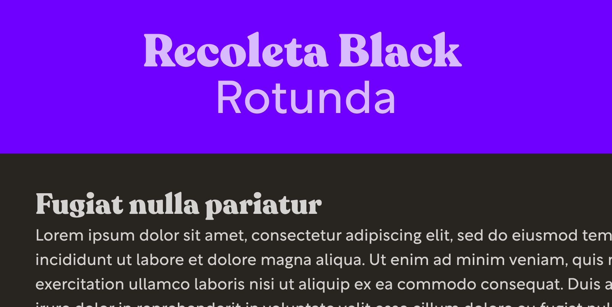
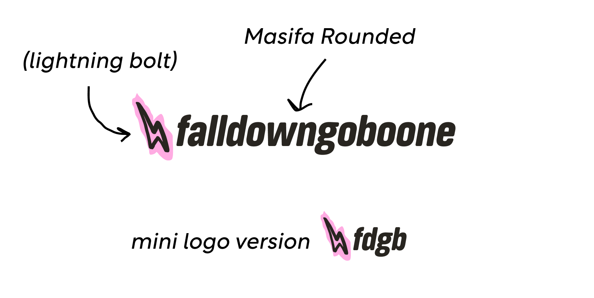

In case you didn't notice, I just pushed up the biggest adjustment to the site design since the [last redesign](https://www.falldowngoboone.com/blog/how-im-redesigning-my-blog/) in late 2020. I wanted to go through it briefly and talk about what's next.

---

From the moment I published the last redesign, I've been working on improvements to the post template. The old posts felt blocky and sterile, and I wasn't happy with the overall reading experience on smaller devices.

For design exploration I turned once again to Figma, relying heavily on the Figma Mirror app on my iPhone and iPad Air. My design goals were to improve post readability and inject some personality into the site.

## Typography updates

The previous body copy was a [system font stack](https://css-tricks.com/snippets/css/system-font-stack/), which I think is great for applications, but for a personal blog, I wanted something slightly more unique. I added my former heading font [Rotunda](https://www.myfonts.com/fonts/tipotype/rotunda/) to the stack. Rotunda was supposed to be the body copy from the start (it's all over my old Figma comps), but I never switched it over on the site until now.

Next, I wanted to replace Rotunda as my heading font with something warm and retro. [Recoleta Black](https://www.myfonts.com/fonts/latinotype/recoleta/) fills the role nicely with soft serifs, tall x-height, and tons of stroke contrast. It's a great counterpoint to the crispness of Rotunda.

Something I'm trying out that I've avoided for quite some time is using units in my line heights. For as long as I can remember I've avoided units in line height because of the way line-height is inherited. Using a unit, even if it's a relative unit, forces the calculated value at the point of assignment to be the line-height of all children.

So why am I using units now? Since unit-less line-height depends on the font size of the box it's assigned to, it was becoming increasingly difficult to maintain a somewhat consistent vertical rhythm. I'm also tying specific line-heights to specific font sizes, so they act like presets now, which makes them easier to track and apply.

This switch was partly inspired by Dan Mall's [Typography in Design Systems](https://superfriendlydesign.systems/articles/typography-in-design-systems/) article, which I heavily recommend (actually, I heavily recommend anything written by Dan). In the article, Dan talks about the utility of creating presets, something that I intend on doing once I have some breathing room.

## The logo

Hey, I've got a new logo! The old logo was a quick scribble in Affinity Designer. The new logo features [Masifa Rounded](https://www.myfonts.com/fonts/hurufatfont-type-foundry/masifa-rounded/), another soft, friendly font (I'm starting to detect a theme here). I feel like in thicker weights it starts to feel like it's been run through an old copier, which I appreciate.

The plan is to eventually add some fun, hand-drawn logo animations that load randomly. I think that'll be a nice way to add a bit more discovery to the site.

## More hand-drawn elements

My original plan was to include more sketched elements from the very beginning, and now I'm starting to follow through with that with the new divider. I have plans to add additional sketch elements throughout.

For now, I'm sketching directly in Figma for a mono-line feel. Soon I'll be getting a new iPad Pro and Apple Pencil, so I'm curious to see what I can do with that setup.

## GitHub Projects

One administrative change is I'm managing the project in [GitHub Projects](https://github.com/features/project-management/). I like keeping everything in a single place, and I've been curious about GitHub Projects for a while.

So far it's been straightforward. I like how I can automate the creation of cards by simply assigning a pull request or issue to my project. I'm using GitHub projects to track my bugs as well.

## What's next

The work is never done, and I'm still focused on finishing out my post template. After that, I have the home page in my sights.

I'd love to look into [`eleventy-img`](https://www.11ty.dev/docs/plugins/image/) for improved image performance. I also need to enable heading links for deep linking. That should only take a couple of minutes.

Finally, I have a desire to explore Web Components. In a recent article, [Josh W. Comeau dives into how he built his blog](https://www.joshwcomeau.com/blog/how-i-built-my-blog/), and he talks at length about how he uses React and MDX to create his one-off, interactive examples. I would love to do something similar with Web Components and Markdown.

## Conclusion

I hope you enjoyed this quick look at the latest adjustments to my blog. I have a lot of fun working on it, especially being able to revisit my design and illustrative roots. Are you in the middle of a blog redesign? [I'd love to hear from you](https://twitter.com/therealboone) about how it's going.

That's it for now. I'll be returning to my regularly scheduled blog posts next month. Catch you then!